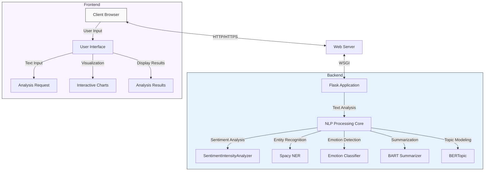
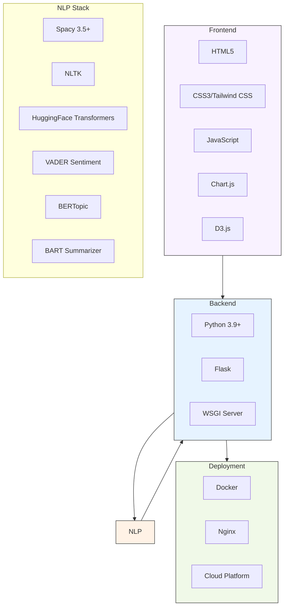
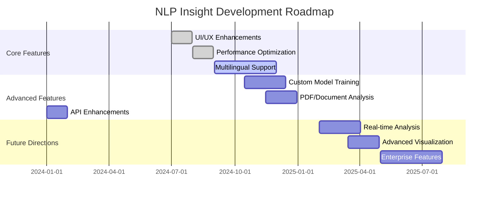

# 🧠 NLP Insight - Modern Text Analysis Platform

> **Advanced natural language processing with state-of-the-art AI analysis**

## 🔍 Overview

NLP Insight is a sophisticated text analysis platform that combines modern UI design principles with powerful natural language processing capabilities. This application enables users to gain deep insights from text through sentiment analysis, emotion detection, entity recognition, topic modeling, and more.

[NLP Insight Demo](https://github.com/Awrsha/Modern-Text-Analysis-Platform/blob/master/NLP%20Insight%20-%20Modern%20Text%20Analysis%20Platform/templates/index.html)

## ✨ Features

-   🎭 **Sentiment & Emotion Analysis** - Detect the emotional tone and sentiment of any text
-   🔍 **Named Entity Recognition** - Identify people, organizations, locations, and more
-   📊 **Advanced Visualizations** - Interactive word clouds, radar charts, and bar graphs
-   📝 **Text Summarization** - Generate concise summaries of longer texts
-   📚 **Topic Modeling** - Discover the main topics and themes within text
-   🔤 **Word & Phrase Analysis** - Examine frequency, bigrams, and trigrams
-   📏 **Readability Metrics** - Assess text complexity and readability
-   🔄 **Text Comparison** - Compare two texts side-by-side with detailed metrics
-   🌓 **Light/Dark Mode** - Automatic theme switching based on system preferences
-   📱 **Responsive Design** - Works beautifully across all devices

## 🏗 System Architecture



## 📦 Installation

### Prerequisites

-   Python 3.9 or higher
-   pip package manager
-   Node.js and npm (for frontend development)

### Setup Instructions

1.  **Clone the repository**

```bash
git clone https://github.com/Awrsha/Modern-Text-Analysis-Platform.git
cd NLP Insight - Modern Text Analysis Platform

```

2.  **Create a virtual environment**

```bash
python -m venv venv
# On Windows
venv\Scripts\activate
# On macOS/Linux
source venv/bin/activate

```

3.  **Install dependencies**

```bash
pip install -r requirements.txt

```

4.  **Download required NLP models**

```bash
python -m spacy download en_core_web_trf
python -m nltk.downloader stopwords

```

5.  **Set up environment variables**

```bash
# On Windows
set FLASK_APP=app.py
set FLASK_ENV=development
# On macOS/Linux
export FLASK_APP=app.py
export FLASK_ENV=development

```

6.  **Run the application**

```bash
flask run

```

The application will be available at `http://localhost:5000`.

## 🚀 Usage

### Basic Text Analysis

1.  Enter or paste your text in the "Text Analysis" section
2.  Click "Analyze Text"
3.  View the comprehensive analysis results:
    -   Sentiment and emotion detection
    -   Text summary
    -   Word cloud visualization
    -   Entity recognition
    -   Frequency analysis

### Text Comparison

1.  Enter two different texts in the "Text Comparison" section
2.  Click "Compare Texts"
3.  Explore the comparative analysis:
    -   Side-by-side sentiment and emotion analysis
    -   Radar chart comparing key metrics
    -   Comparative entity detection
    -   Word frequency comparison

## 📘 API Documentation

NLP Insight exposes RESTful API endpoints for integration with other applications.

### Analyze Text

**Endpoint:** `/analyze`

**Method:** `POST`

**Request Body:**

```json
{
  "text": "Your text content to analyze goes here."
}

```

**Response:**

```json
{
  "sentiment": "Positive",
  "sentimentScore": 0.76,
  "emotion": "joy",
  "emotionScore": 0.82,
  "summary": "Concise summary of the text...",
  "entities": [
    {"entity": "Microsoft", "label": "ORGANIZATION"},
    {"entity": "New York", "label": "LOCATION"}
  ],
  "topics": [
    {"label": "technology software development", "score": 0.45},
    {"label": "business innovation strategy", "score": 0.31}
  ],
  "wordFreq": [
    ["technology", 12],
    ["innovation", 8]
  ],
  "bigrams": ["artificial intelligence", "machine learning"],
  "trigrams": ["natural language processing", "data science applications"],
  "complexity": 0.68,
  "readability": "College",
  "readabilityScore": 0.74
}

```

### Compare Texts

**Endpoint:** `/compare`

**Method:** `POST`

**Request Body:**

```json
{
  "text1": "First text content to compare.",
  "text2": "Second text content to compare."
}

```

**Response:**

```json
{
  "text1": {
    "sentiment": "Positive",
    "sentimentScore": 0.65,
    "emotion": "approval",
    "emotionScore": 0.72,
    "entities": [...],
    "wordFreq": [...],
    "metrics": [0.45, 0.82, 0.56, 0.7, 0.68, 0.35]
  },
  "text2": {
    "sentiment": "Negative",
    "sentimentScore": 0.58,
    "emotion": "disappointment",
    "emotionScore": 0.64,
    "entities": [...],
    "wordFreq": [...],
    "metrics": [0.62, 0.28, 0.72, 0.45, 0.52, 0.7]
  }
}

```

## 🔧 Technology Stack



## 📊 Performance Considerations

### Memory Requirements

-   **Minimum RAM:** 4GB (basic functionality)
-   **Recommended RAM:** 8GB+ (full feature set)

The application loads several NLP models that require significant memory:

-   Spacy's `en_core_web_trf`: ~1GB
-   HuggingFace models: ~2-4GB combined
-   BERTopic: ~500MB

### Optimization Techniques

1.  **Lazy Loading:** Models are loaded only when needed
2.  **Batching:** Large texts are processed in chunks
3.  **Caching:** Frequent analysis results are cached to improve response time
4.  **Asynchronous Processing:** Long-running analyses are processed asynchronously

### Scaling Considerations

For high-traffic deployments, consider:

-   Horizontal scaling with multiple instances
-   Redis for distributed caching
-   Load balancing for request distribution
-   Model quantization for reduced memory footprint

## 🗓 Development Roadmap



### Upcoming Features

-   🌐 **Multilingual Support** - Text analysis in multiple languages
-   📄 **Document Analysis** - Support for PDF, DOCX, and other document formats
-   🔄 **Real-time Analysis** - Stream text analysis as you type
-   📱 **Mobile App** - Native mobile applications
-   🤖 **Custom Model Training** - Train specialized models on your own data
-   🔐 **Enterprise Features** - SSO, role-based access control, and audit logs
